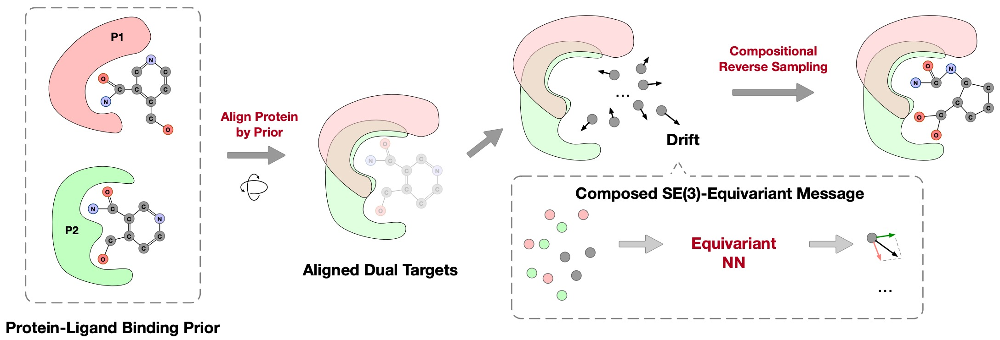

# DualDiff

This repository is the official implementation of Reprogramming Pretrained Target-Specific Diffusion Models for Dual-Target Drug Design (NeurIPS 2024). [[PDF]](https://arxiv.org/pdf/2410.20688) 

<p align="center">
   
</p>

## Installation

Our codebase is built upon [TargetDiff](https://github.com/guanjq/targetdiff).

Please refer to the official repo of TargetDiff for details about installation. 

Differently, the following dependencies are required:
```
python -m pip install numpy==1.23.1
python -m pip install meeko==0.3.0
```

## Dataset

The curated dataset is provided at https://huggingface.co/datasets/zhouxiangxin/DualDiff.

Download `data.tar.gz`, uncompress it, and put it under the folder of the project.

The data is organized as follows:
```
data/processed/dock/index_dict.pkl
data/processed/drug_synergy/synergy_idx_list.pkl
...
data/processed/dock/ligand_protein_dataset_v2/CC12CCC3C(CCC4=CC(=O)C=CC43C)C1CCC(=O)O2/
data/processed/dock/ligand_protein_dataset_v2/CC12CCC3C(CCC4=CC(=O)C=CC43C)C1CCC(=O)O2/P11511/
data/processed/dock/ligand_protein_dataset_v2/CC12CCC3C(CCC4=CC(=O)C=CC43C)C1CCC(=O)O2/P11511/ligand.sdf
data/processed/dock/ligand_protein_dataset_v2/CC12CCC3C(CCC4=CC(=O)C=CC43C)C1CCC(=O)O2/P11511/pocket_10A.pdb
data/processed/dock/ligand_protein_dataset_v2/CC12CCC3C(CCC4=CC(=O)C=CC43C)C1CCC(=O)O2/P11511/protein.pdb
data/processed/dock/ligand_protein_dataset_v2/CC12CCC3C(CCC4=CC(=O)C=CC43C)C1CCC(=O)O2/P11511/protein_clean.pdb
...
data/processed/dock/ligand_protein_dataset_v2/c1cnc2cc3c(cc2n1)C1CNCC3C1/
data/processed/dock/ligand_protein_dataset_v2/c1cnc2cc3c(cc2n1)C1CNCC3C1/P32297/
data/processed/dock/ligand_protein_dataset_v2/c1cnc2cc3c(cc2n1)C1CNCC3C1/P32297/ligand.sdf
data/processed/dock/ligand_protein_dataset_v2/c1cnc2cc3c(cc2n1)C1CNCC3C1/P32297/pocket_10A.pdb
data/processed/dock/ligand_protein_dataset_v2/c1cnc2cc3c(cc2n1)C1CNCC3C1/P32297/protein.pdb
data/processed/dock/ligand_protein_dataset_v2/c1cnc2cc3c(cc2n1)C1CNCC3C1/P32297/protein_clean.pdb
...
```
where `index_dict.pkl` is the mapping file from indices (from 0 to 437 inclusively) to smiles of the reference ligands, and `synergy_idx_list.pkl` is a list where each element is a tuple of two indices, indicating that the two targets are synergistic and there are poteinal dual-target drugs for these two targets.

`CC12CCC3C(CCC4=CC(=O)C=CC43C)C1CCC(=O)O2` is the smiles of a reference ligand and `P11511` is the UniProt ID of the corresponding target.

`*/ligand.sdf` is the sdf file of the reference ligand. `pocket_10A` is the pocket. (The residues within a 10 Å range of the reference molecule are retained.)
`protein.pdb` and `protein_clean.pdb` are complete proteins.

Please note that the preprocessed data is for research purposes only.

## Dual-Target Drug Design


### Model Checkpoint

DualDiff and CompDiff are sampling algorithms. The base model is targetdiff. Please follow the instructions of official repo of TargetDiff to download the pretrained model.

The download link is also provided as follows:

https://drive.google.com/drive/folders/1-ftaIrTXjWFhw3-0Twkrs5m0yX6CNarz?usp=share_link

### Pocket Alignment

For DualDiff and CompDiff, the pockets of the dual targets need to be aligned. The alignment is based on generated ligands which can be selected by different criteria.

Please see `dual_scripts/align/align_protein_ligand_score.py` for example. 

As an example, a pair of aligned pockets based on **Max Vina Dock** is provided at `outputs/composition_score/8/104`.

The following visualization shows the pocket, the reference lgiand, and the generated ligand of target A (left) (idx=8) and target B (middle) (idx=104) and the aligned pockets (right).

|  |  |  |
|------------------------------------|------------------------------------|-----------------------------------------------|

### Sampling

Examples of sampling algorithms are provided as follows:

To sample for a single target, please refer to `dual_scripts/example/sample_targetdiff.sh`.

To sample for dual targets by DualDiff, please refer to `dual_scripts/example/sample_targetdiff.sh`.

To sample for dual targets by CompDiff, please refer to `dual_scripts/example/sample_compdiff.sh`.

### Evaluation 

The evaluation is the same as TargetDiff. We also provided examples at `dual_scripts/evaluate`.


## Citation
```
@inproceedings{
  zhou2024reprogramming,
  title={Reprogramming Pretrained Target-Specific Diffusion Models for Dual-Target Drug Design},
  author={Xiangxin Zhou and Jiaqi Guan and Yijia Zhang and Xingang Peng and Liang Wang and Jianzhu Ma},
  booktitle={The Thirty-eighth Annual Conference on Neural Information Processing Systems},
  year={2024},
}
```
